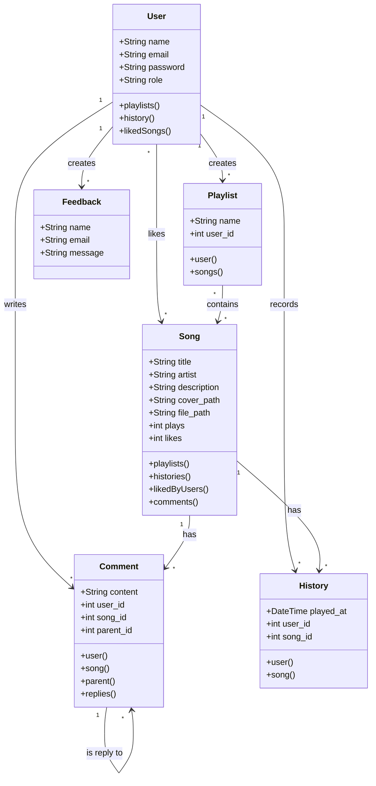

# UKM Band - Backend API & Mobile Music Platform
[](https://deepwiki.com/Ashlxxy/Tubes-APB.git)

This repository contains the source code for a music streaming platform developed for the Telkom University Student Activity Unit (UKM) Band. The project is now organized around a Laravel backend/API and a Flutter mobile application.

## Project Structure

The repository is organized into the following main directories:

-   `backend/`: Contains the Laravel backend/API, database migrations, seeders, and demo media assets.
-   `ukm_band_mobile/`: Contains the source code for the Flutter mobile application.
-   `backend/database/dumps/Database-TubesKel2.sql`: SQL dump file for setting up demo data.

---

## 1. Backend API (Laravel)

A Laravel backend that powers authentication, songs, streaming, playlists, likes, comments, and listening history for the mobile app.

### Features

#### User Features
*   **Authentication**: Secure login and registration system.
*   **Music Discovery**: Fetch latest and popular songs through the API.
*   **Audio Streaming**: Stream uploaded audio files through protected API routes.
*   **Playlist Management**: Create, manage, and add songs to personal playlists.
*   **Social Interaction**: "Like" favorite songs and post nested comments on song pages.
*   **Listening History**: Easily access recently played songs.
*   **Mobile API Support**: Provides the endpoints used by the Flutter app.

### Tech Stack

*   **Backend**: Laravel 12 (PHP 8.2+)
*   **API Auth**: Laravel Sanctum
*   **Database**: MySQL / MariaDB (production), SQLite (development)
*   **Asset Bundling**: Vite

### Backend Setup

1.  **Prerequisites**:
    *   PHP >= 8.2
    *   Composer
    *   Node.js & npm
    *   A database server (e.g., MySQL, MariaDB).

2.  **Clone the Repository**:
    ```bash
    git clone https://github.com/Ashlxxy/Tubes-APB.git
    cd Tubes-APB/backend
    ```

3.  **Install Dependencies**:
    ```bash
    composer install
    npm install
    ```

4.  **Environment Setup**:
    *   Copy the example environment file:
    ```bash
    cp .env.example .env
    php artisan key:generate
    ```

5.  **Database Setup**:
    *   Create a new database for the project (e.g., `ukm_band`).
    *   Update your `.env` file with your database credentials (DB_DATABASE, DB_USERNAME, DB_PASSWORD).
    *   Import the provided SQL dump to get the complete demo data:
    ```bash
    mysql -u [your_username] -p [your_database_name] < database/dumps/Database-TubesKel2.sql
    ```
    *   Alternatively, you can run migrations and seeders (this may provide different data than the SQL dump):
    ```bash
    php artisan migrate --seed
    ```
    
6.  **Storage Link**:
    ```bash
    php artisan storage:link
    ```

7.  **Build Assets and Run Server**:
    ```bash
    npm run build
    php artisan serve
    ```
    The API will be available at `http://127.0.0.1:8000/api`.

> **Note:** If you experience large file upload errors, run the server with:
> `php -d upload_max_filesize=100M -d post_max_size=100M -S 127.0.0.1:8000 -t public`

### Demo Accounts

| Role       | Email                 | Password |
| :--------- | :-------------------- | :------- |
| **Admin**  | `admin@ukmband.telkom`| `admin123` |
| **User**   | `user@example.com`    | `password` |

---

## 2. Mobile Application (Flutter)

A companion mobile application built with Flutter that allows users to listen to music from the UKM Band platform on the go.

### Features

*   **Home Screen**: Displays recently added songs and playlists.
*   **Search and Library**: Placeholder screens for future search and library management functionality.
*   **Integrated Audio Player**: A mini-player and a provider-based audio system using the `audioplayers` package to stream music.

### Tech Stack

*   **Framework**: Flutter
*   **State Management**: Provider
*   **Dependencies**: `http`, `audioplayers`, `google_fonts`

### Mobile Application Setup

1.  **Prerequisites**:
    *   Flutter SDK
    *   An editor with the Flutter plugin (e.g., VS Code, Android Studio).
    *   An Android/iOS emulator or a physical device.

2.  **Navigate to Directory**:
    ```bash
    cd Tubes-APB/ukm_band_mobile
    ```

3.  **Install Dependencies**:
    ```bash
    flutter pub get
    ```

4.  **Configure API Endpoint**:
    *   The current API endpoint is hardcoded for the Android emulator (`http://10.0.2.2:8000`).
    *   Open `lib/services/api_service.dart`.
    *   Change the `baseUrl` to point to your running Laravel backend's local IP address if you are running on a physical device.

5.  **Run the Application**:
    ```bash
    flutter run
    ```
---

## Database Class Diagram

<details>
<summary>Click to view Class Diagram</summary>



</details>
